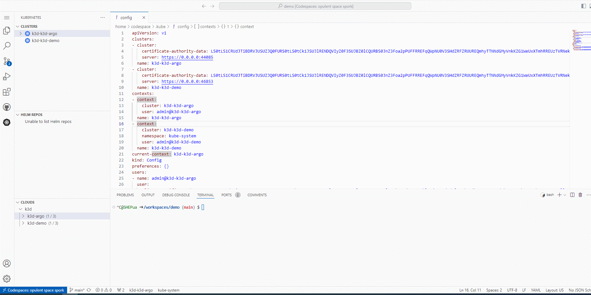
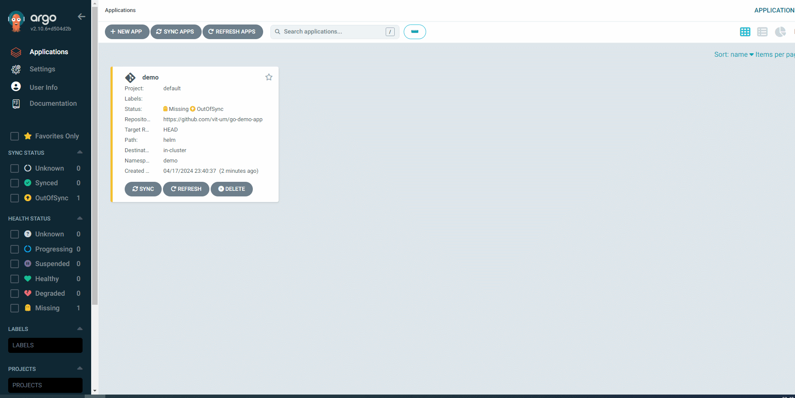

# demo
HW 4

# PoC. ArgoCD

ArgoCD реалізує підхід GitOps використовуючи репозиторій Git як джерело істини для визначення бажаного стану програми.

## Демонстрація
Після встановлення та розвертання Argo, нам стане доступний веб-інтерфейс керування.

У веб-інтерфейсі можливе додавання необхідних додатків, налаштування їх синхронізації.

